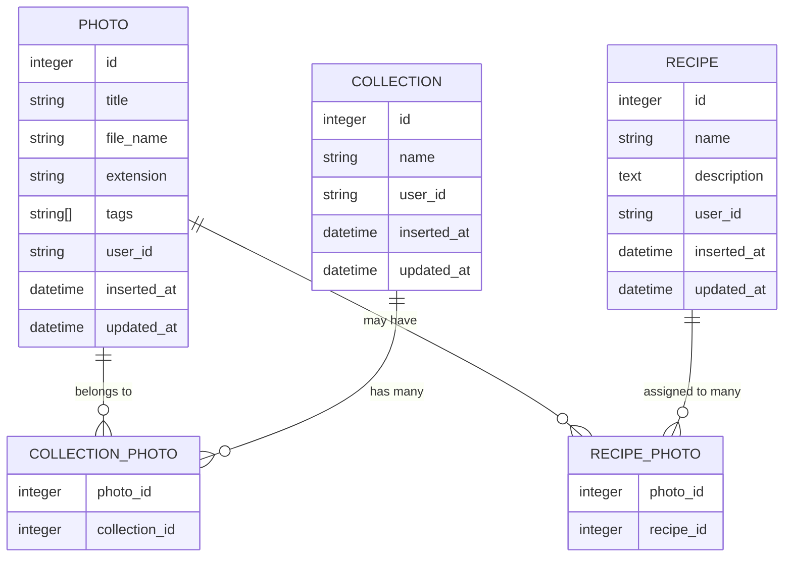

```mermaid

erDiagram
    PHOTO {
        integer id
        string title
        string file_name
        string extension
        string[] tags
        string user_id
        datetime inserted_at
        datetime updated_at
    }

    COLLECTION {
        integer id
        string name
        string user_id
        datetime inserted_at
        datetime updated_at
    }

    RECIPE {
        integer id
        string name
        text description
        string user_id
        datetime inserted_at
        datetime updated_at
    }

    PHOTO ||--o{ COLLECTION_PHOTO : "belongs to"
    COLLECTION ||--o{ COLLECTION_PHOTO : "has many"
    PHOTO ||--o{ RECIPE_PHOTO : "may have"
    RECIPE ||--o{ RECIPE_PHOTO : "assigned to many"

    COLLECTION_PHOTO {
        integer photo_id
        integer collection_id
    }

    RECIPE_PHOTO {
        integer photo_id
        integer recipe_id
    }
```
